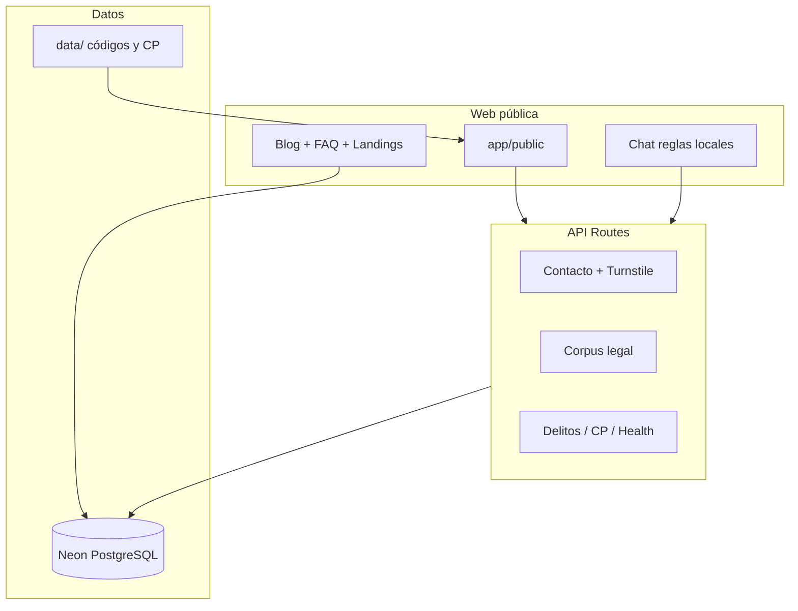

# Pineda y Asociados

Plataforma web jurídica para el despacho **Pineda y Asociados** (Nacaome,
Valle, Honduras): sitio corporativo indexable, blog especializado,
catálogo de delitos del Código Penal (Decreto 130-2017), SEO/GEO,
analítica con consentimiento y chat de preconsulta.

- **Sitio en producción:** [pinedayasociadoshn.com](https://www.pinedayasociadoshn.com)
- **Protocolo para agentes IA:** [`AGENTS.md`](AGENTS.md)
- **Contribución:** [`CONTRIBUTING.md`](CONTRIBUTING.md)
- **Histórico:** [`CHANGELOG.md`](CHANGELOG.md)

---

## Qué demuestra este repositorio

| Capacidad | Implementación |
|-----------|----------------|
| Web pública SEO-first | Next.js App Router, metadata centralizada, JSON-LD, landings locales |
| Contenido jurídico verificable | Fuentes canónicas en `data/` (CP, códigos, delitos) — sin inventar normativa |
| Chat de preconsulta | Motor de reglas **local** + proxy NotebookLM opcional con palabra clave |
| Calidad continua | ESLint, TypeScript estricto, Vitest, Playwright, CI en GitHub Actions |

---

## Stack (verificado en `package.json`)

- **Framework:** Next.js 16 (App Router) + React 19
- **Estilos:** Tailwind CSS v4
- **Base de datos:** Neon PostgreSQL + Drizzle ORM
- **Testing:** Vitest + Playwright (E2E)
- **Node:** ≥ 22 · **npm:** ≥ 10

---

## Inicio rápido

```bash
git clone <repo> && cd "Justicia Verdadera"
npm install
cp .env.example .env.local   # configurar variables (sin secretos en Git)
npm run dev                  # http://localhost:3000
```

Con `DATABASE_URL` válida: blog, FAQ y páginas editables desde DB. Sin DB,
la web pública y la mayoría de tests unitarios funcionan en modo degradado.

### Validación local (reproduce CI)

```bash
npm run lint
npm run typecheck
npm run test
npm run build:ci
```

---

## Arquitectura



- **Web pública:** rutas en `app/(public)/` — narrativa canónica (breadcrumbs,
  hero, contenido, CTA, FAQ cuando aporta).
- **Chat público:** `POST /api/chat` — reglas locales, rate-limit, guardrails;
  NotebookLM solo con palabra clave interna documentada.
- **Proxy:** `proxy.ts` añade correlation ID; cada handler valida CRON/webhook/API key.

---

## Seguridad (controles existentes)

- `proxy.ts` con correlation ID; APIs con validación propia
- Rate limiting en contacto, consulta, suscripción y chat
- Zod en rutas mutables; `sanitize-html` en HTML de entrada
- Consent Mode v2: analítica solo tras consentimiento explícito

> Controles técnicos orientados al cumplimiento — **no constituyen afirmación de
> cumplimiento legal absoluto**. La confirmación normativa requiere revisión
> jurídica humana.

Variables de entorno: referencia canónica en [`.env.example`](.env.example).
Secretos (`.env.local`, `.secrets/`, datos live GSC/Bing) **nunca** se commitean.

---

## Estructura del repositorio

```
app/           Rutas Next.js (público + API)
components/    UI pública, blog, design system
lib/           SEO, chat, DB, legal
data/          Fuentes legales estáticas y manifiestos SEO
tools/         Scripts de CI y DB (versionados)
tests/         Vitest + Playwright
drizzle/       Migraciones SQL
public/        Estáticos, OG, PWA, verificación Bing
```
