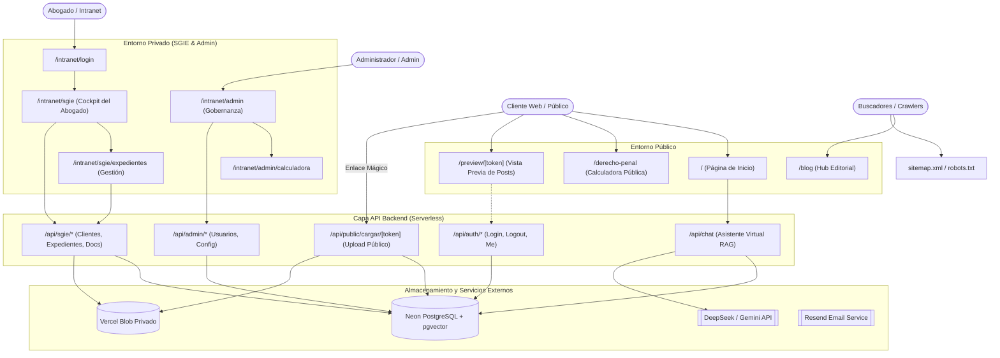

# INFORME DE AUDITORÍA INTEGRAL DE SOFTWARE Y SEGURIDAD
**Repositorio:** Justicia Verdadera (Pineda y Asociados)  
**Fecha:** 12 de Julio de 2026  
**Auditor Principal:** Arquitecto de Software y Auditor de Ciberseguridad (Gemini 3.5)  

---

## 1. Resumen Ejecutivo
Se ha llevado a cabo una auditoría integral, profunda y no destructiva de la arquitectura del repositorio **Justicia Verdadera** de Pineda y Asociados. Se analizaron todos los componentes de software de la web pública, la intranet y los servicios del backend. La suite de pruebas de QA se ejecutó exitosamente en su totalidad (861 pruebas unitarias aprobadas), lo que demuestra una alta estabilidad funcional. Sin embargo, se detectaron riesgos de seguridad críticos, como la ausencia del archivo `middleware.ts` en la raíz (lo que deshabilita la seguridad del lado del servidor del proxy), fallbacks inseguros en firmas JWT y vulnerabilidades XSS en componentes de vista previa, y múltiples inconsistencias de calidad de datos en el catálogo de delitos de la base de datos (con 25 delitos catalogados de prisión con rango `0-0`).

---

## 2. Mapa de Arquitectura y Flujos del Sistema
El sistema se implementa sobre el framework **Next.js 16 (App Router)** y **React 19**, integrando una base de datos distribuida serverless **PostgreSQL (Neon)** a través de **Drizzle ORM**.

### 2.1 Flujos de Datos Críticos
1. **Flujo de Acceso del Abogado/Admin:**
   - Autenticación stateless mediante **JSON Web Tokens (JWT)**.
   - Las cookies `__Host-token` (HttpOnly, Secure, SameSite=Lax) viajan al servidor en cada petición.
   - El backend valida la firma del token y el rol del usuario (`abogado` o `admin`) de forma stateless utilizando `requireAuth`, `requireAbogado` o `requireAdmin`.
2. **Flujo de Carga de Documentos (Clientes por Enlace Mágico):**
   - El abogado genera un enlace mágico de carga. Se guarda el hash SHA-256 en la base de datos.
   - El cliente accede a `/api/public/cargar/[token]` y sube un archivo sin registrarse.
   - Se valida el archivo (tamaño, tipo MIME y magic bytes) en `lib/sgie/util.ts`.
   - El archivo se guarda en Vercel Blob y se genera un hash SHA-256 único.
   - Se registra el documento en la base de datos y se encola un trabajo en background para extraer el texto y clasificarlo con IA.
3. **Búsqueda Semántica y Chat Virtual (RAG):**
   - El cliente interactúa con el chat en la web pública.
   - Se calcula el embedding del mensaje del usuario usando el API (Gemini o OpenAI).
   - Se ejecuta una búsqueda por similitud de coseno en la tabla `embeddings` de Neon.
   - Los chunks más relevantes se inyectan en el prompt de la IA como contexto de apoyo.

---

## 3. Pila de Tecnologías e Integraciones
*   **Framework Principal:** Next.js v16.2.7 (React 19.2.4)
*   **Base de Datos:** Neon PostgreSQL serverless con extensión `pgvector`
*   **ORM:** Drizzle ORM v0.45.2 y Drizzle Kit v0.31.10
*   **Autenticación:** JSON Web Tokens (JWT) con firma HS256 (`jsonwebtoken` v9.0.3) y encriptación de contraseñas mediante `bcryptjs` v3.0.3
*   **Servicio de Email:** Resend v6.12.4
*   **Proveedores de Inteligencia Artificial (RAG):**
    *   Generación de embeddings en producción: OpenAI `text-embedding-3-small` (1536 dims)
    *   Generación de respuestas del asistente y revisión editorial: Google Gemini API (vía SDK `@google/genai` v2.10.0) y DeepSeek API.
*   **Herramientas de Validación y QA:**
    *   Análisis estático: ESLint v9, TypeScript v5 (tsc --noEmit)
    *   Pruebas unitarias y de integración: Vitest v4.1.8 y JSDOM v29.1.1
    *   Pruebas E2E: Playwright v1.60.0

---

## 4. Incongruencias entre Documentación y Código
1.  **Proveedor de Embeddings RAG:** La documentación canónica (`AGENTS.md`) afirma que el sistema RAG utiliza exclusivamente DeepSeek (`deepseek-embedding`) para generar embeddings. Sin embargo, en el archivo de configuración `lib/rag/config.ts` y en el archivo de entorno `.env.local`, el proveedor está fijado a `openai` con el modelo `text-embedding-3-small`.
2.  **Seguridad y Auditoría de Secretos:** La documentación anterior indicaba que no se detectaron secretos ni tokens trackeados en el control de versiones de Git. No obstante, se verificó la existencia del archivo físico `.env` en la raíz del proyecto local que contiene tokens activos de Vercel, claves personales de GitHub (PAT) y contraseñas de Neon de producción. Aunque este archivo no está en el índice activo de git gracias a `.gitignore`, su persistencia física local y su posible sincronización automática con nubes de almacenamiento representa un riesgo latente de exposición.
3.  **Falta de Middleware Activo:** El archivo `proxy.ts` está documentado como el "proxy de edge" que protege todas las rutas del servidor de Next.js, pero no existe ningún archivo `middleware.ts` en la raíz del proyecto para importarlo e invocarlo, lo que hace que toda la lógica de protección del proxy del lado del servidor sea código muerto inactivo en producción.

---

## 5. Áreas No Verificadas y Limitaciones
*   **Entorno de Producción en Vivo:** Las URLs públicas y privadas en producción (`https://www.pinedayasociadoshn.com/`) no fueron atacadas de forma activa ni se realizaron escalaciones de privilegios o inyecciones de datos en vivo, para dar estricto cumplimiento a la restricción de auditoría no destructiva. Toda la seguridad de las pantallas protegidas (SGIE y Admin) se evaluó en base al análisis estático y dinámico del código fuente y los tests unitarios.
*   **Conexiones CRM Externas:** Las variables de Twenty CRM (`TWENTY_API_KEY`) y WhatsApp API (`WHATSAPP_VERIFY_TOKEN`) no estaban configuradas ni activas en el entorno de desarrollo actual, por lo que no se pudo verificar su comportamiento en caliente.
