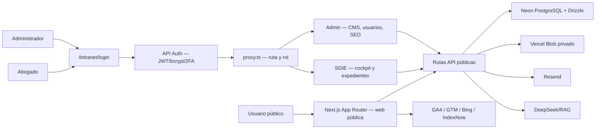

# Informe integral de auditoría — Pineda y Asociados

**Fecha:** 2026-07-12  
**Estado:** `VALIDADO` con limitaciones explícitas  
**Alcance:** repositorio local, web pública, SGIE y Administración en producción  
**Naturaleza:** auditoría y documentación; no se implementaron correcciones ni rediseños

## Resumen ejecutivo

El producto compila, supera el tipado, ejecuta 861 pruebas unitarias y pasa 22 pruebas E2E de solo lectura contra producción. La web pública entrega CSP endurecida, las rutas públicas sensibles probadas devuelven 404, y la separación de página entre el rol abogado y `/intranet/admin` funcionó en producción. SGIE y Admin respondieron en escritorio y a 390×844 sin desbordamiento horizontal.

La postura no puede calificarse como segura para producción mientras permanezcan dos defectos de autorización/autenticación:

1. **Crítica:** el challenge 2FA se firma como una sesión completa de 24 horas y es aceptado por el mismo verificador de sesión; establecerlo como cookie permite eludir el segundo factor.
2. **Alta:** la consulta y actualización de clientes no rechaza a un abogado sin expedientes asociados al cliente. Un UUID conocido permite leer y modificar PII de otro ámbito.

También requieren prioridad alta: las dos cuentas entregadas para la auditoría comparten una contraseña débil; el flujo de recuperación envía a `/reset`, ruta inexistente; la vista previa transporta el borrador completo dentro de un JWT en URL y renderiza HTML sin sanitizar; y `npm audit` informa 15 dependencias vulnerables (5 altas, 10 moderadas).

## Alcance y metodología

- Inventario de 1.216 archivos relevantes, 87 páginas, 142 rutas API, 69 declaraciones de tabla, 42 suites Vitest y 6 specs Playwright.
- Lectura de configuración, proxy, autenticación, 2FA, CSRF, rate limiting, recuperación, previews, carga documental y capas de acceso SGIE.
- Barridos estáticos de sanitización, HTML peligroso, tipado débil, logs, secretos versionados, mutaciones y controles de autorización.
- `seo:doctor` y `seo:collect` conforme a `AGENTS.md`.
- Navegación autorizada en producción con ambos roles, sin enviar formularios de negocio ni modificar datos.
- Validación local: lint, TypeScript, Vitest, cobertura, build, audit de dependencias y versiones disponibles.
- E2E contra producción restringido a navegación/lectura. Se excluyeron specs con POST o creación de registros.

No se realizaron ataques, fuerza bruta, explotación del bypass 2FA, acceso a objetos ajenos, subida de archivos, publicación, cambios de configuración ni pruebas de carga.

## Arquitectura comprobada

### Tecnologías e integraciones

| Área | Implementación comprobada |
|---|---|
| Frontend/backend | Next.js 16.2.7, React 19.2.4, TypeScript, Tailwind CSS 4 |
| Persistencia | Neon PostgreSQL, Drizzle ORM; `lib/schema.ts` contiene 69 declaraciones `pgTable` |
| Sesión | JWT HS, bcryptjs rounds 12, cookie `__Host-token` en producción |
| Seguridad web | Proxy, CSP, HSTS, X-Frame-Options, CSRF por Origin/Referer, Zod, rate limit DB |
| Documentos | Vercel Blob privado; fallback filesystem solo local |
| Email | Resend, inbound webhook firmado, contacto y autorespuesta |
| IA/RAG | DeepSeek embeddings, pgvector, OCR/extracción y jobs SGIE |
| Analítica/SEO | GSC, GA4, Bing, IndexNow, sitemap DB-driven |
| Calidad | ESLint, TypeScript, Vitest, Playwright, GitHub Actions |

## Flujos críticos

### Autenticación y roles

`/intranet/login` consulta usuario, verifica bcrypt, estado/bloqueo y, si no hay 2FA, emite JWT de 24 horas. `proxy.ts` clasifica rutas públicas, APIs, SGIE y Admin. En producción se comprobó que el abogado autenticado fue redirigido de `/intranet/admin` a `/intranet/sgie`. La API administrativa no pudo verificarse live por bloqueo del cliente de navegador; su protección quedó contrastada por código y tests, no por una solicitud productiva directa.

### SGIE

El cockpit consume clientes, expedientes, documentos, tareas, agenda, alertas y correo. El scope de expedientes está aplicado en consultas mediante asignaciones/permisos. El scope de clientes es inconsistente: el listado sí filtra, pero el detalle no niega acceso cuando el conteo asignado es cero.

### Admin

Integra CMS de blog/FAQ/páginas/menús/medios, usuarios/roles, SEO, auditoría y herramientas jurídicas. La densidad funcional es alta y varias acciones rápidas duplican destinos de la navegación lateral.

### Contenido público y SEO

La web pública utiliza metadata, sitemap, robots, JSON-LD, canonical y páginas locales. La recolección live actualizó 4/6 fuentes: Bing, IndexNow, health y sitemap. GSC/GA4 fallaron con `invalid_grant`; sus datos previos existen, pero no se consideran frescos al 2026-07-12.

## Controles positivos validados

- `git status` estaba limpio al inicio; `.env`, `.env.local`, `.env.vercel` y `.secrets` no están versionados.
- Cookie de producción HttpOnly, Secure, SameSite=Lax; fallback antiguo se elimina al iniciar sesión.
- Mutaciones autenticadas inspeccionadas incorporan `validateCsrf`.
- Login evita enumeración básica con “Credenciales inválidas” y aplica rate limit persistente fail-closed para prefijos sensibles.
- Webhook inbound de Resend falla cerrado en producción y escapa contenido reenviado.
- Carga documental valida tamaño, extensión, MIME/magic bytes, hash y almacena Blob con `access: private`.
- CSP live no contiene `unsafe-eval`, incluye `object-src 'none'` y `frame-ancestors 'self'`.
- Build completo, chunks y generación estática finalizaron correctamente; IndexNow permaneció en dry-run.

## Calidad, rendimiento y mantenibilidad

- Cobertura global: 51,31 % líneas, 50,90 % statements, 45,44 % branches, 51,69 % functions.
- Cobertura débil en límites críticos: `proxy.ts` 18,05 % líneas; RAG 2,38 %; `expedientes-db.ts`, `documentos-db.ts` y `jobs-db.ts` 0 % en el reporte.
- El build depende de Google Fonts en red; el primer intento falló dentro del sandbox y el segundo pasó con red autorizada.
- No se obtuvo un presupuesto de bundle por ruta. El build sí comprobó 7 chunks y 354 páginas estáticas.
- La suite E2E completa no es segura contra la DB configurada: crea usuarios/casos y deja limpieza manual.

## UI/UX y accesibilidad

SGIE y Admin exponen enlace “Saltar al contenido”, nombres accesibles en controles principales y navegación responsive. A 390×844 ambos mantuvieron `scrollWidth === clientWidth` y ofrecieron “Abrir menú”. Las tablas de Admin ocultaron columnas secundarias en móvil.

Limitaciones: no se ejecutó lector de pantalla real, matriz completa de teclado, contraste automatizado, Safari/Firefox ni estados destructivos/de error de formularios. El rediseño recomendado se documenta en `REDISENO-SGIE-ADMIN.md`.

## Diferencias documentación–implementación

- README declara 754 pruebas/35 suites; la ejecución real fue 861/42.
- README describe “70+ endpoints”; existen 142 rutas `route.ts`.
- README describe 66 tablas según AGENTS; el código contiene 69 declaraciones `pgTable`.
- El callback OAuth se documenta como protegido, pero `proxy.ts` lo marca público.
- El preview documental afirma que el storage actual usa URL pública, mientras `lib/sgie/util.ts` configura Blob privado.
- El layout permite `/intranet/recuperar-clave`, pero no existe página; el email enlaza a `/reset`, también inexistente.

## Limitaciones y NO VALIDADO

- No se explotó el bypass 2FA ni el IDOR de clientes.
- No se verificó MFA con una cuenta que lo tuviera habilitado.
- No se probaron POST/PATCH/DELETE, subida/descarga real, correo, OCR/IA, restauración de backup ni recuperación ante desastre en producción.
- No se ejecutaron E2E que crean usuarios/casos por riesgo de modificar la DB configurada.
- No se validó autorización API live con sesión por bloqueo del navegador; sí se revisó proxy/handlers/tests.
- GSC y GA4 live no se refrescaron por `invalid_grant`.
- No se verificaron índices/planes SQL con `EXPLAIN`, capacidad bajo carga, RPO/RTO, alertas Vercel/Neon ni navegadores distintos de Chromium.

## Conclusión

El producto tiene una base técnica funcional y controles defensivos importantes, pero la autenticación 2FA y el aislamiento de clientes contienen fallos incompatibles con datos jurídicos sensibles. La siguiente fase debe ser un sprint de remediación de seguridad, comenzando por invalidar el challenge 2FA como credencial de sesión, corregir el scope de clientes y rotar las credenciales proporcionadas. Después deben repararse recuperación/preview, actualizar dependencias y añadir pruebas específicas antes de cualquier rediseño visual.

