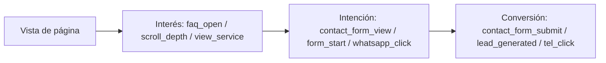

# Plan de medición SEO/GEO — Pineda y Asociados

> Fuente: extracción real GA4 (property `541022095`, 90 días: 2026-05-05 → 2026-08-03).
> Este documento define el modelo de medición de conversiones y su estado real.

## 1. Contexto

El bufete mide tráfico orgánico y microconversiones en GA4. Este plan fija el
modelo de eventos, su estado de llegada real a GA4 y las brechas de medición
detectadas, para que la estrategia de contenido (ver `content-roadmap.md`) se
priporice sobre **datos observados**, no supuestos.

- Propiedad GA4: `541022095` · Measurement ID: `G-L2PGBN3SWK`
- Período de referencia: 90 días (2026-05-05 → 2026-08-03)
- Ventana de atribución recomendada: 28 días (estándar para conversiones de
  formularios/WhatsApp de baja frecuencia)

## 2. Embudo de conversión del bufete

## 3. Inventario de eventos: estado real en GA4

### 3.1 Eventos que SÍ llegan (observados 90 días)

| Evento                        | Helper                              | Recuento real (90d) | Tipo            |
| ----------------------------- | ----------------------------------- | ------------------- | --------------- |
| `form_start`                  | GA4 enhanced measurement            | 67                  | Microconversión |
| `faq_open`                    | `trackFaqOpen`                      | 11                  | Interés         |
| `whatsapp_click`              | `trackWhatsAppClick`                | 9                   | Intención       |
| `contact_form_view`          | `trackContactFormView`           | 3                   | Intención       |
| `phone_click`                 | `trackPhoneClick`                   | 3                   | Conversión      |
| `file_download`               | enhanced measurement                | 2                   | Interés         |
| `lead_generated`              | `trackLeadGenerated`                | 2                   | Conversión      |
| `view_service`                | `trackViewService`                  | 2                   | Interés         |
| `chat_opened` / `chat_closed` | `components/chat/chat-analytics.ts` | 1 / 1               | Intención       |
| `internal_click`              | `trackInternalClick`                | 1                   | Interés         |
| `seo_blog_cta_click`          | —                                   | 1                   | Intención       |

### 3.2 Eventos definidos en código y su estado (tras cierre §9 PR26)

| Evento                | Helper                       | Estado 2026-08-03                                                                        |
| --------------------- | ---------------------------- | --------------------------------------------------------------------------------------- |
| `contact_form_submit` | `trackContactFormSubmit`     | **Instrumentado** tras HTTP 2xx, sin PII, con guard anti-doble-envío. Key event YA en GA4. |
| `contact_form_start`  | `trackContactFormStart`      | Renombrado desde `consultation_form_start`. No observado aún (nuevo).                     |
| `contact_form_error`  | `trackContactFormError`      | Renombrado desde `consultation_form_error`; categorías controladas. No observado aún.     |
| `consultation_cta_click` | `trackConsultationCtaClick` | Nuevo; CTA principal de consulta. No observado aún.                                       |
| `email_click`         | `trackEmailClick`            | No observado aún. **Key event pendiente: REQUIRES_DASHBOARD_ACTION** (SA sin permiso de escritura). |
| `directions_click`    | `trackDirectionsClick`       | No observado.                                                                           |
| `scroll_depth`        | `trackScrollDepth`           | No observado (puede depender de threshold).                                              |
| `click_maps`, `blog_search`, `view_team_section`, `view_local_page`, `cta_local`, `cta_spain`, `view_spain_service` | varios | No observados o por debajo de umbral. |

### 3.3 Diagnóstico

- **Conversión principal instrumentada (2026-08-03).** `contact_form_submit` se
  envía solo tras confirmación del servidor (HTTP 2xx = solicitud persistida),
  con parámetros no personales (`form_name`, `page_path`, `service_area`,
  `submission_status`, `transport`) y guard anti-doble-envío. Ya está marcado
  como key event en GA4.
- **`email_click` requiere acción manual** en GA4 (key event); la service
  account no tiene permiso de escritura (§10).
- **Volumen bajo de eventos** (chat_opened=1, lead_generated=2) coherente con
  tráfico orgánico modesto (621 clics GSC / 180 días) y sin datos CrUX
  (origen sin volumen para Chrome UX Report).
- **Consentimiento:** el banner de cookies puede bloquear `gtag` hasta el
  consentimiento (ver `components/cookie-consent.tsx`). Los eventos se cuentan
  solo tras consentimiento `granted`; sin consentimiento no se envía ningún
  evento GA4 identificable (gtag no se carga con GA ID).

## 4. Modelo de medición (estado 2026-08-03)

1. **`contact_form_submit` instrumentado** en el manejador de éxito (HTTP 2xx),
   sin PII, con guard anti-doble-envío y categorías de error controladas. Key
   event YA configurado en GA4.
2. **Familia unificada `contact_form_*`**: view/start/error/submit (renombrada
   desde `consultation_*`). `form_start` (enhanced) sigue como señal de interés.
3. **Revisar umbral de `scroll_depth`** y `faq_open` como señales de
   engagement en posts (ya operativas).
4. **Key events en GA4 (verificados vía Admin API):** `contact_form_submit` ✓,
   `whatsapp_click` ✓, `phone_click` ✓, `lead_generated` ✓. **`email_click`
   pendiente: REQUIRES_DASHBOARD_ACTION** (GA4 → Propiedad 541022095 → Key
   events → nuevo → `email_click`). No marcar `contact_form_start` ni
   `contact_form_error` como conversiones.
5. **Ventana 28 días** para reportes de conversión; los KPI por landing se
   evalúan con `ga4-organic-conversions.csv` (141 landing pages).

## 5. KPI por fuente

| Fuente | KPI primario                                          | Instrumento       | Última extracción              |
| ------ | ----------------------------------------------------- | ----------------- | ------------------------------ |
| GSC    | Clics, impresiones, CTR, posición por página          | `seo:data` → GSC  | 2026-08-03 (180d)              |
| GA4    | Usuarios, sesiones, keyEvents, conversiones orgánicas | `seo:data` → GA4  | 2026-08-03 (90d)               |
| Bing   | Consultas, impresiones, CTR, datos de rastreo         | `seo:data` → Bing | 2026-08-03 (54d rastreo)       |
| CrUX   | Core Web Vitals                                       | BigQuery público  | SIN DATOS (origen sin volumen) |

## 6. Dependencia con la estrategia de contenido

Las prioridades del `content-roadmap.md` (UPDATE 29, EXPAND 1, MERGE 3) se
ordenan por **oportunidad GSC real** (27 filas en `gsc-opportunities.csv`) y
**oportunidad Bing real** (41 filas en `bing-opportunities.csv`), no por
intuición. Re-optimizar solo tras validar que la página tiene impresiones y
que el keyEvent correspondiente llega a GA4.
